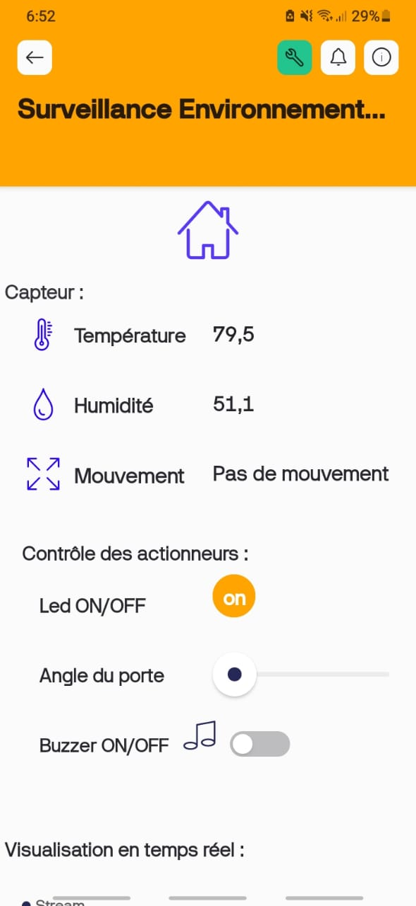

# 🌡️ Surveillance Environnementale avec ESP32 et Blynk

## 🔍 Description
Ce projet permet de surveiller la **température**, l’**humidité** et le **mouvement** à l’aide d’un microcontrôleur **ESP32** et d’une application **Blynk**.  
L’utilisateur peut également contrôler à distance une **LED**, un **buzzer**, et un **servo moteur** (porte).

---

## ⚙️ Matériel utilisé
- ESP32
- Capteur DHT22 (température et humidité)
- Capteur PIR (mouvement)
- Servo moteur
- LED
- Buzzer

---

## 📲 Fonctionnalités
- Lecture de la température et de l’humidité en temps réel  
- Détection de mouvement  
- Commande à distance (LED, Buzzer, Servo) via Blynk  
- Interface mobile intuitive

---

## 🔌 Schéma de connexion

---

## 📱 Interface Blynk

---

## 🧠 Code source
Le code se trouve dans le fichier `Surveillance_ESP32.ino`.  
Il gère la communication entre les capteurs, actionneurs et l’application Blynk.

